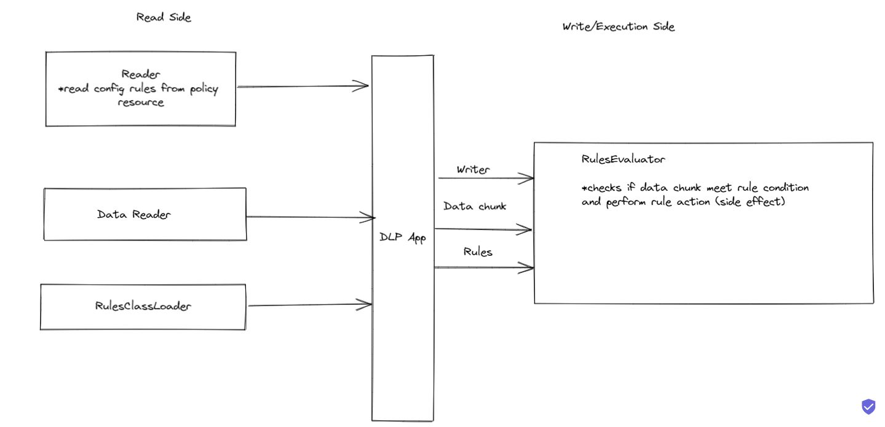

# Rules evaluator

Your mission if you choose to accept it, will be to write a rules evaluator to identify common patterns,  
also known as DLP

## Requirements
Each rule should have conditions and actions, the condition defines what should be evaluated and the action defines  
what to do if the condition is met.  
Any rule must have 1 or more condition/action, each condition will have a matching action

* Use a logger so we can follow the logic
* Consider error handling
* Add tests
* We will try to load a very big data set of data, so consider performance

### Condition explained
There should 2 type of conditions
1. Simple - textual match, as in the example  
   SSN has certain validations, the condition should define them and the action should report if they match
2. Complex (This is optional) - evaluate an expression such as is number max length 10 digits ("len < 11")

### Action
An action should be able to run any given code which is predefined in the rule if the rule has a match  (make a side effect)

### Accept as input new rules
You may read rules from a file in any format that you prefer (e.g.: json, xml ..), please provide 3 examples

### Accept data as input
Accept as input a given block of text which is fetched only in runtime by the program from the internet  
(as input accept a url)

### Report
Write a report containing all the matches found by the rules

### Expected output for the home project
* A working Java solution
* Create and load a file in your chosen format for the 3 rules from the "Test DLP.docx" file
* Get a URL as input to the program (For Example: https://www.protecto.ai/wp-content/uploads/2020/08/Book1.xlsx-us-social-security-22-cvs.csv)
* Output to a file a report of the rules evaluation

## Good luck

# Solution Design:

## Notes
- actions and conditions are loaded by runtime with reflections (no framework was needed here, DI is simulated with simple configurations on Main class).
- The solution is highly testable , and was tested on important logic, with no IO envloved.
- The configuration of the policy is located at the resources' folder, but can also be loaded via cli command with -cr option, the url can be adjusted with -u option.
- The Data from the web is streamed to disk, then is streamed back as lines to the DLP app and analyzed by the RulesEvaluator (this can be optimized but decided to keep it that way).
- The solution was not packaged, I think I invested enough time as it is.
- 